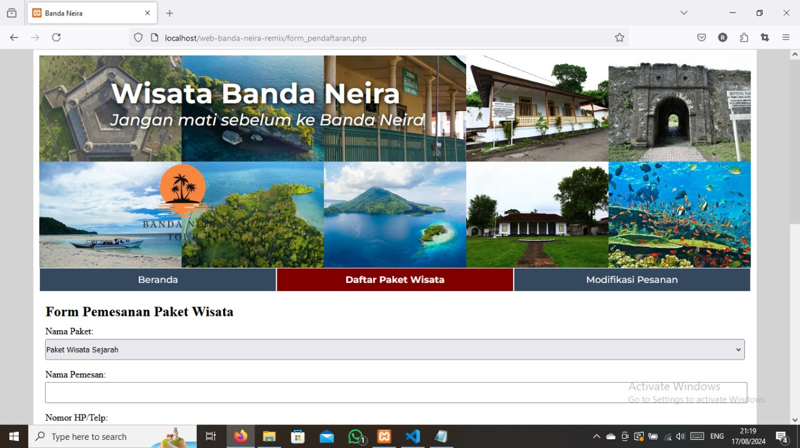

# 🌴 Banda Neira Tourism Web App

A simple web-based application to manage **tour packages** and **tour bookings** in Banda Neira. This platform is designed to help tourists explore and book packages easily, while also allowing administrators to manage tour data efficiently.

---

## ✨ Main Features

- 🔍 Browse available tour packages
- 📝 Book tour packages online
- 📂 Manage tour package data (CRUD for admin)
- 📦 Manage booking data (admin)

---

## 🛠️ Technologies Used

- **Frontend:** HTML, CSS
- **Backend:** PHP
- **Database:** MySQL
- **Others:** Bootstrap

---

## 🚀 Getting Started

1. **Clone the repository:**

   ```bash
   git clone https://github.com/mriaer/web-banda-neira.git
   ```

2. **Place the project folder in the `htdocs` directory** (for XAMPP users).

3. **Create a new database** via phpMyAdmin and import the `pariwisata_db.sql` file.

4. **Start Apache and MySQL** via XAMPP control panel.

5. **Access the app in your browser:**

   ```
   http://localhost/web-banda-neira
   ```

---

## 📸 Screenshots




---

## 📬 Contributing

Contributions are welcome! Feel free to fork the repository and submit a pull request for any improvements or bug fixes.
